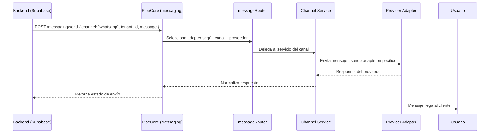

# 🏗️ Arquitectura de Mensajería - PipeCore API

## 📖 Descripción

La nueva arquitectura de mensajería de PipeCore API sigue un patrón modular y escalable con adaptadores específicos por proveedor, permitiendo múltiples canales (SMS, WhatsApp, Email) y múltiples proveedores (Twilio, Meta, SendGrid, Resend) de manera transparente.

## 🧩 Estructura del módulo

```
src/messaging/
├── messageRouter.ts              # Router principal para seleccionar adaptadores
├── messagingService.ts           # Servicio principal (entrada de API)
├── messagingController.ts        # Controlador REST principal
├── messaging.module.ts           # Módulo principal
├── channels/                     # Canales de mensajería
│   ├── whatsapp/
│   │   ├── twilioAdapter.ts      # Adaptador Twilio para WhatsApp
│   │   ├── metaAdapter.ts        # Adaptador Meta para WhatsApp
│   │   └── whatsappService.ts    # Servicio WhatsApp (lógica común)
│   ├── sms/
│   │   ├── twilioAdapter.ts      # Adaptador Twilio para SMS
│   │   └── smsService.ts         # Servicio SMS (lógica común)
│   └── email/
│       ├── sendgridAdapter.ts    # Adaptador SendGrid para Email
│       ├── resendAdapter.ts      # Adaptador Resend para Email
│       └── emailService.ts       # Servicio Email (lógica común)
├── utils/                        # Utilidades comunes
│   ├── normalizePayload.ts       # Normalización de payloads
│   ├── validatePhone.ts          # Validación de números de teléfono
│   └── templates.ts              # Plantillas de mensajes
├── interfaces/                   # Interfaces TypeScript
│   └── messaging.interface.ts    # Interfaces compartidas
└── constants/                    # Constantes del sistema
    └── messaging.constants.ts    # Constantes de mensajería
```

## 🔄 Flujo de trabajo



## 🧠 Responsabilidad por capa

| Archivo / módulo | Responsabilidad |
|------------------|-----------------|
| `messagingService.ts` | Entrada principal del módulo (API del core). Decide canal (whatsapp, sms, email, etc.). |
| `messageRouter.ts` | Determina qué adapter usar según tenant y canal. |
| `channels/<canal>/<provider>Adapter.ts` | Implementación específica de un proveedor (Twilio, Meta, etc.). |
| `channels/<canal>/<canal>Service.ts` | Lógica común del canal: validación, formateo, template, logging. |
| `utils/` | Helpers comunes (plantillas, normalización, validación). |

## 🚀 Endpoints principales

### 1. Enviar mensaje por canal

```http
POST /messaging/send/{channel}
Content-Type: application/json

{
  "tenant_id": "tableflow_123",
  "to": "+56988888888",
  "body": "Tu pedido fue confirmado ✅",
  "mediaUrls": ["https://example.com/image.jpg"]
}
```

**Canales disponibles:**
- `sms` - Mensajes de texto
- `whatsapp` - WhatsApp con soporte para medios
- `email` - Correos electrónicos con HTML

### 2. Webhook universal

```http
POST /messaging/webhook/{channel}?tenant_id=tableflow_123&provider=twilio
Content-Type: application/x-www-form-urlencoded

MessageSid=SM1234567890&From=+56988888888&Body=Hola&MessageStatus=received
```

### 3. Logs por canal

```http
GET /messaging/logs/{tenantId}/{channel}?limit=50
```

### 4. Logs de todos los canales

```http
GET /messaging/logs/{tenantId}?limit=50
```

### 5. Estadísticas de mensajería

```http
GET /messaging/stats/{tenantId}
```

### 6. Mensaje de prueba

```http
POST /messaging/test/{channel}
Content-Type: application/json

{
  "tenant_id": "tableflow_123",
  "to": "+56988888888"
}
```

### 7. Health check

```http
GET /messaging/health
```

### 8. Canales disponibles

```http
GET /messaging/channels
```

## 🏗️ Ventajas de esta arquitectura

| Ventaja | Descripción |
|---------|-------------|
| 🧩 **Escalable** | Puedes agregar canales (Push, Telegram) sin tocar los demás. |
| 🔄 **Reusable** | Unifica formato y flujo entre canales. |
| 💬 **Multi-proveedor** | Puedes cambiar Twilio → Meta API sin romper integraciones. |
| 🧠 **Mantenible** | Cada adapter está aislado y testeable. |
| 🔐 **Multi-tenant seguro** | Cada tenant puede tener su propio proveedor y número. |
| ⚙️ **Observabilidad** | Puedes loguear todos los mensajes en una tabla message_logs. |

## 🔧 Configuración de proveedores

### Por defecto (variables de entorno)

```bash
# Twilio
TWILIO_ACCOUNT_SID=ACxxxxxxxxxxxxxxxxxxxxxxxxxxxxxxxxx
TWILIO_AUTH_TOKEN=xxxxxxxxxxxxxxxxxxxxxxxxxxxxxxxx
TWILIO_WHATSAPP_NUMBER=whatsapp:+14155238886
TWILIO_PHONE_NUMBER=+1234567890

# SendGrid
SENDGRID_API_KEY=SG.xxxxxxxxxxxxxxxxxxxxxxxxxxxxxxxx

# Resend
RESEND_API_KEY=re_xxxxxxxxxxxxxxxxxxxxxxxxxxxxxxxx

# Meta
META_ACCESS_TOKEN=xxxxxxxxxxxxxxxxxxxxxxxxxxxxxxxx
META_PHONE_NUMBER_ID=123456789012345
META_VERIFY_TOKEN=xxxxxxxxxxxxxxxxxxxxxxxxxxxxxxxx
```

### Por tenant (programático)

```typescript
// Configurar proveedor específico para un tenant
await messageRouter.setProvider('tableflow_123', 'whatsapp', {
  provider: 'meta',
  credentials: {
    accessToken: 'meta_token_here',
    phoneNumberId: '123456789012345',
    verifyToken: 'verify_token_here',
  },
  isActive: true,
});
```

## 📊 Ejemplos de uso

### Desde Supabase Edge Function

```typescript
// Enviar WhatsApp
const response = await fetch('https://pipecore-api.com/messaging/send/whatsapp', {
  method: 'POST',
  headers: { 'Content-Type': 'application/json' },
  body: JSON.stringify({
    tenant_id: 'tableflow_123',
    to: '+56988888888',
    body: 'Tu pedido #ORD-123 está listo para recoger! 🍕',
    mediaUrls: ['https://example.com/receipt.jpg']
  })
});

// Enviar SMS
const smsResponse = await fetch('https://pipecore-api.com/messaging/send/sms', {
  method: 'POST',
  headers: { 'Content-Type': 'application/json' },
  body: JSON.stringify({
    tenant_id: 'tableflow_123',
    to: '+56988888888',
    body: 'Pizza Corner: Pedido #ORD-123 confirmado. Total: $15.990. Tiempo: 30 min'
  })
});

// Enviar Email
const emailResponse = await fetch('https://pipecore-api.com/messaging/send/email', {
  method: 'POST',
  headers: { 'Content-Type': 'application/json' },
  body: JSON.stringify({
    tenant_id: 'tableflow_123',
    to: 'cliente@email.com',
    subject: 'Confirmación de pedido #ORD-123',
    htmlContent: '<h2>¡Pedido confirmado!</h2><p>Tu pedido está siendo preparado...</p>',
    textContent: '¡Pedido confirmado! Tu pedido está siendo preparado...',
    from: 'noreply@pizzacorner.com'
  })
});
```

### Respuesta automática a mensajes entrantes

```typescript
// El webhook puede configurarse para responder automáticamente
// La lógica está en whatsappService.ts -> handleAutoResponse()

// Ejemplo de respuesta automática:
if (messageBody.includes('hola')) {
  await sendWhatsAppMessage(
    tenantId,
    from,
    '¡Hola! 👋 ¿En qué puedo ayudarte?'
  );
}
```

## 🔄 Migración desde la estructura anterior

La nueva arquitectura es completamente compatible con la anterior, pero ofrece más flexibilidad:

### Antes (estructura monolítica)
```typescript
// Un solo servicio para todo
await twilioService.sendMessage({
  channel: 'whatsapp',
  tenantId: 'tableflow_123',
  to: '+56988888888',
  body: 'Mensaje'
});
```

### Ahora (estructura modular)
```typescript
// El router selecciona automáticamente el proveedor correcto
await messagingService.sendWhatsapp(
  'tableflow_123',
  '+56988888888',
  'Mensaje'
);
```

## 🚨 Consideraciones importantes

1. **Compatibilidad**: La nueva API mantiene compatibilidad con la anterior
2. **Migración gradual**: Puedes migrar tenant por tenant
3. **Configuración**: Los tenants existentes usan configuración por defecto
4. **Logs**: Todos los mensajes se registran en el mismo formato
5. **Webhooks**: Los webhooks mantienen la misma estructura

## 🔮 Próximas mejoras

- [ ] Soporte para Push Notifications (Expo, FCM)
- [ ] Integración con Telegram
- [ ] Dashboard de configuración de proveedores
- [ ] A/B testing automático de proveedores
- [ ] Métricas en tiempo real
- [ ] Retry automático con backoff exponencial
- [ ] Rate limiting por tenant y canal
